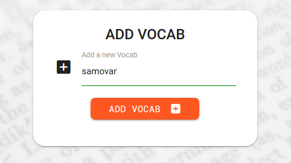
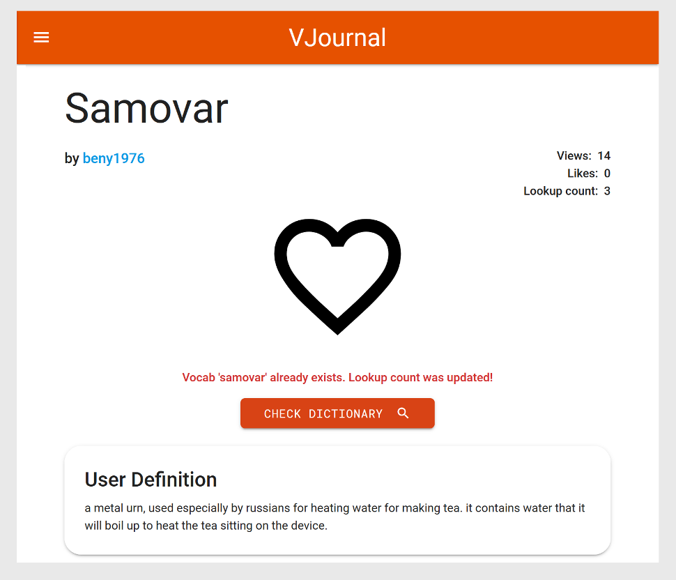
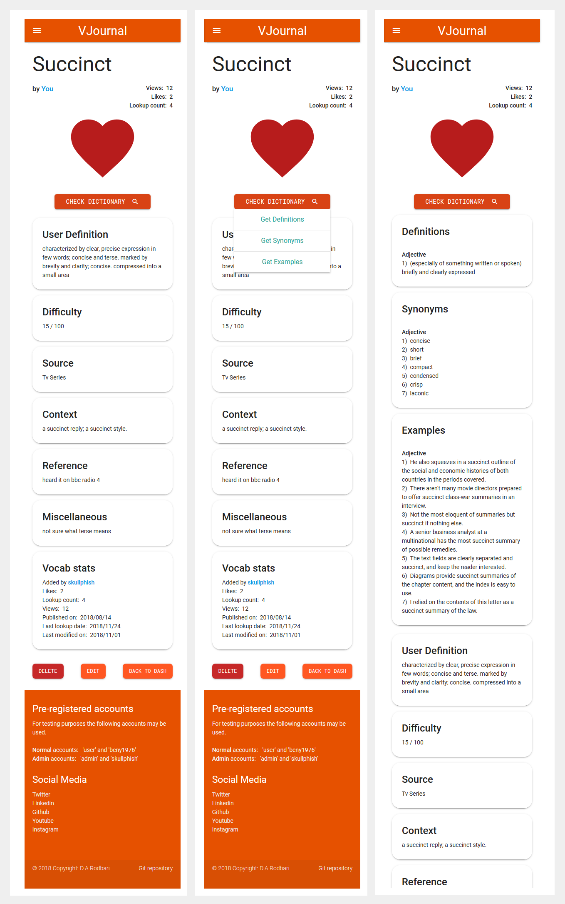

VOCABULARY JOURNAL
==================

Aim
---

As non-native english speaker, to this day, I find myself reaching for the
dictionary every now and then, almost on weekly basis. This has been the bane of
my existence for as long as I can remember. Even as a native speaker, I’m sure
you’ve had to look up definitions at some point in your life, which is an easy
enough task to do. The whole process could be wrapped up in matter of seconds,
even if you don’t have a dictionary installed on your phone.

However, a few weeks or months later, I find myself looking up a vocab that
sounds familiar to me. I can’t quite remember its definition, but I’m sure I’ve
looked it up before. I just can’t remember when or where it was that i first
heard or read this specific vocab or even in what context it was used. For all I
know, I could have looked it up multiple times and had simply forgotten about
it.

How does one keep track of these vocabs? Wouldn’t it be great if there was an
app, that could take in any vocab, define it for you, force you to write your
own definition (helping it to sink it), and then let you attach other bits of
information such as how the vocab was used (context), where the vocab was used
(reference; e.g. Clerks 2 movie, 27 minutes in), tags (e.g. YouTube,
Engineering, Medicine), sources (e.g. News, Movies, Articles ) or even a rating
system (difficulty; 70/100) and then store it all for you in one place?

Wouldn’t it be amazing if it could also give you statistics about the vocab?
Stats such as, when it was first looked up (publish date), when it was last
looked up (last lookup date), how many times it was looked up (lookup count),
when it was last modified (last modified date) and how many times it was viewed
(view count).

Well, this project does exactly that!

Pre-registered testing accounts
-------------------------------

Please feel free to use the following accounts for testing purposes. For more
information about the differences between normal and admin accounts please refer
to “[Admin privileges](#admin-privileges)” of the features section.

-   Admin account:

    -   skullphish

    -   admin

-   Normal accounts:

    -   beny1976

    -   user

How it works
------------

The user tries to add a vocab into the database. If the vocab isn’t already in
the database, the user will be directed to a page where he/she can fully define
the vocab in his/her words and store it in the database with the help of the
built-in dictionary.

However, if the vocab already exists in the database, then it simply means that
the user has indeed looked up that particular vocab in the past. At this stage
the user is directed to the vocab’s page, where the full vocab statistics, user
definitions and other user inputs can be viewed. But what we are most interested
in, is the lookup details, how many times this particular vocab was looked up
and when it was last looked up. Using the lookup details, the users can then
track and study their vocabs, in the hopes of improving their vocabulary, while
assessing their own performance and progress.

Wireframes
==========

Wireframes created using [mockingbird](https://gomockingbird.com/home).

Features
========

The list below shows all the added features that needed to be in place for the
project to be fully functional. The features planned to be added in the future
are listed in the “[Future Features](#future-features)” section of this
documentation.

-   registration – allows users to register
    ([register.html](https://github.com/damianism/vocab_journal/blob/master/templates/register.html)).

-   Login – registered users can log in
    ([index.html](https://github.com/damianism/vocab_journal/blob/master/templates/index.html)).

-   vocab pool – show all vocabs entered by all users
    ([dash.html](https://github.com/damianism/vocab_journal/blob/master/templates/dash.html)).

-   view existing vocabs – show all vocab details and stats full screen
    ([vocab.html](https://github.com/damianism/vocab_journal/blob/master/templates/vocab.html))

-   view user profiles – view user information
    ([view_user.html](https://github.com/damianism/vocab_journal/blob/master/templates/view_user.html))

-   filter and sort vocabs

-   users to like/dislike vocabs

-   edit existing vocabs – user defined vocabs only, refer to [Admin
    privileges](#admin-privileges)
    ([edit_vocab.html](https://github.com/damianism/vocab_journal/blob/master/templates/edit_vocab.html))

-   delete existing vocabs – user defined vocabs only, refer to [Admin
    privileges](#admin-privileges)

-   manage sources (admin only) – user defined vocabs only, refer to [Admin
    privileges](#admin-privileges)
    ([manage_source.html](https://github.com/damianism/vocab_journal/blob/master/templates/manage_sources.html))

-   add a new vocab

    -   check vocab –
        ([check_vocab.html](https://github.com/damianism/vocab_journal/blob/master/templates/check_vocab.html))

        -   vocab already exists (CORE FEATURE) –
            ([vocab.html](https://github.com/damianism/vocab_journal/blob/master/templates/vocab.html))

        -   new vocab may be added –
            ([add_vocab.html](https://github.com/damianism/vocab_journal/blob/master/templates/add_vocab.html))

    -   define vocab – using [built-in dictionary](#built-in-oxford-dictionary)

        -   generate definitions

        -   generate synonyms

        -   generate example sentences

    -   add [user inputs](#user-input)

    -   initialise tracking parameters

        -   publish date

        -   user – the user whom the vocab was added by

        -   lookup count

        -   views

        -   modified date

        -   last lookup date

        -   likes

Built-in Oxford Dictionary 
---------------------------

This feature was written using the [Oxford Dictionary
API](https://developer.oxforddictionaries.com/documentation#!/The32Sentence32Dictionary/get_entries_source_language_word_id_sentences)
which will generate the following either automatically or on demand by the user
depending on which template it is being accessed from.

-   Vocab definitions

-   Vocab synonyms

-   Vocab example sentences (context)

The built-in dictionary will automatically generate definitions, synonyms and
example sentences on the “[add
vocab](https://github.com/damianism/vocab_journal/blob/master/templates/add_vocab.html)”
template. While on “[view
vocab](https://github.com/damianism/vocab_journal/blob/master/templates/vocab.html)”
and “[edit
vocab](https://github.com/damianism/vocab_journal/blob/master/templates/edit_vocab.html)”
templates, it can be accessed interactively on demand through the dedicated
button shown below to speed up the loading times of vocabs full view.

User Input
----------

This section is part of the add vocab and edit vocab templates, allowing the
user to fully define the vocab and add as much information as they can to be
stored in the database.

### User Definition

Allowing the user can define using their own word with the help of the built-in
dictionary.

### Difficulty

Allowing the user to rate the vocabs by its difficulty which can be later on
used to filter the vocabs on the dash template.

### Sources

Predefined categories to be used with vocabs. For example, YouTube, Engineering,
technology and so on. Users can only select from one of the pre-existing
sources. Only admin may add or delete sources ([Admin
privileges](#future-features)). However, users may add [tags](#tags).

### Context

Allowing the use to enter the exact sentence/idiom/term the vocab it was used
in.

### Reference

Store information about where the vocab was used. For example, opening scene of
clerks 2 (2008 release)

### Tags

Similar to “sources” but aimed to mimic functionality of hashtags (was not
implemented due to shortage of time). Users can add as many hashtags as they
desire, unlike “sources” that are only managed by admins. Tags give the user all
the flexibility they could possibly need without spamming the core content of
the database (Sources).

### Miscellaneous

Any other information or reminders to be added by the user that’s not
implemented in the form such as links to source (another dictionary, video clip
and so on)

Like/unlike vocabs
------------------

Allowing users to like a particular vocab, user profile will also show which
vocabs were liked by the user.

The liked vocabs are shown in a much bigger form when its view full screen via
the view vocab template. As opposed to the liked vocabs shown on the dash vocab.

The vocabs liked by the logged in user are shown in the vocab pool as
solid red heart on the dash template.

Tracking parameters
-------------------

The following parameters are generated and modified automatically based on the
user activities.

### Publish date

Date at which the vocab was first published (looked up) by the user.

### Last lookup date

The date on which the vocab was LAST looked up

Logic: if the vocab already exists, it will be viewed using the “vocab” template
and the “lookup counter” parameter for that particular vocab is updated.

### Lookup count

How many times the vocab was looked up

### Last modified date

The date on which the vocab was last modified or updated. Logic is smart enough
to recognise that no changes were made, hence it doesn’t update the “date last
modified” parameter.

### Views

Number of views for the vocab

Vocab pool
----------

Referred to as dashboard throughout the project. Users can view vocabs added by
all the other users (admins can change or delete all the vocabs). The vocabs can
then be filtered using the [filtering](#filter) feature.

User profiles
-------------

Shows user-specific information, vocabs added by the user (links to the actual
vocabs) and vocabs liked by the user (links to the actual vocabs).

View Vocab
-----------

Shows the vocab contents along with its stats within in a single page using 
the vocab template.

Interface
---------

The covabs are each shown using an accodion element, the body of the accordion holds 
the vocab content. The header of the accordion however, is used to show a brief 
description of the vocab.

Items on the accordion headings are listed below in order starting from the left.

-   vocab
-   user's username
-   favourite icon (if liked by the logged in user, it will turn solid red)
-   number of likes
-   lookup count icon
-   number of lookups

Filter
------

Allows the user filter the generated vocabs in dash to be filtered and sorted
according to the user’s selections.

### User vocabs only

Filters out all the vocabs added by other users to show only the vocabs added
the logged in user. This feature is set to show all vocabs by default.

-   Show all vocabs
-   Show user vocabs only

### Sources

The following sources are added by default. Only admins can add or remove
sources. Users have to use the existing provided list of sources.

-   TV series (default)
-   Movies
-   News
-   Articles
-   Games
-   Book

### Sort by

Sorts the resulting vocabs by the following parameters

-   Lookup date (default) – link to lookup date
-   Lookup count – link to lookup
-   Views
-   Likes
-   Difficulty
-   Publish date
-   Modified date

### Order

Reorders the resulting vocabs by the following orders

-   Ascending
-   Descending

Admin Privileges 
-----------------

By default, a user can only change or delete a vocab that was added by
him/herself. However, Admins have the power to edit or delete the vocabs added
by any user. Additionally, they can add and remove sources.

### Dynamic Navbar

The image above shows how the navbar changes if a user is logged in.
Furthermore, if an admin is logged in, an extra nav link is provided.

### Modify or Delete Vocabs

As mentioned above, users can only edit/delete the vocabs they have added. The
image below shows the difference between a user and an admin account on the dash
template. The admin can edit/delete a vocab added by the user “beny1976”, but
the user can’t make any of those changes as he/she did not add the vocab.

Future Features
===============

All the features listed within this section WILL be added upon completion of the
course in the exact order listed below. The following features were shelved only
due to lack of time and my hectic work schedule but will be perused once the
course is completed to be presented as a portfolio.

1.  Paginations

2.  User-specific lookup details

3.  Enhanced administration tools

    1.  delete users

    2.  edit user info

4.  Global search box to search keywords in

    1.  vocabs

    2.  tags

    3.  reference text

    4.  miscellaneous text

    5.  context text

5.  Adding vocab pronunciations (audio)

6.  More languages – API supports multiple languages

7.  Users to be able to download all their entered data (all user vocabs and
    their stats)

8.  Vocab of the day

9.  Vocab memory test game

    1.  One of the vocabs entered by the user will be presented to the user to
        define with a very basic scoring system e.g. “you managed to get 7/10
        definitions right”

Database Schemas
================

This project consists of three collections. The schema for each is presented
below.

Vocabs
------

Users
-----

Sources
-------

Technologies Used
=================

The list of technologies used for this project in no specific order.

1.  [Python](https://www.python.org/downloads/) v3.4.3

    -   Unittest module for Test Driven Development.

2.  [FLASK](http://flask.pocoo.org/) v1.0.2

3.  [Jinja2](http://jinja.pocoo.org/docs/2.10/)

    -   Used to apply logic to flask templates

4.  Markdown

5.  Pip3

    -   Used to install various python modules.

6.  [Oxford dictionary
    API](https://developer.oxforddictionaries.com/documentation#!/The32Sentence32Dictionary/get_entries_source_language_word_id_sentences)

    -   Dictionary API built into the project as a fully functional dictionary,
        allowing the user to easily and quickly find the vocab’s definitions,
        synonyms and example sentences.

7.  [MongoDB](https://www.mongodb.com/)

    -   Non-relational database used for this project in conjunction with
        [mLab](https://mlab.com/welcome/).

    -   [flask_pymongo](https://flask-pymongo.readthedocs.io/en/latest/)

8.  [Materialize front-end framework
    v0.100.2](http://archives.materializecss.com/0.100.2/)

    -   Responsive design

    -   Styling

        -   Cards, Buttons, accordions, animations, tooltips and so on.

        -   Text alignment.

        -   Colouring.

9.  JavaScript and [jQuery](https://jquery.com/) v3.3.1

    -   Debugging

    -   Disabling the “ENTER” key on the index page form.

    -   Conversion of Flask template variables to JavaScript variables.

    -   User input “Tags” functionality

        -   Clear tags

        -   Add tags

        -   Duplication check

    -   Materialize

        -   Component initialisations such as datepicker, select, buttons,
            tooltips and accordions.

        -   API “check dictionary” dropdown button.

10. AJAX

    -   Used in conjunction with the API “check dictionary” button to
        dynamically load vocab definitions, synonyms and example sentences in
        “edit_vocab” and “add_vocab” templates.

11. [SASS](https://sass-lang.com/)

    -   Adopted main method of styling. Used with combination of SASS variables,
        mixins and functions in total of 8 scss files.

12. HTML5

13. CSS

    -   Used with SASS.

14. Flexbox

    -   Primary tool for centring item.

    -   Primary layout tool.

15. [Google fonts](https://fonts.google.com/)

    -   [Roboto Mono](https://fonts.google.com/specimen/Roboto+Mono) – applied
        to the buttons (small and large)

    -   [Roboto](https://fonts.google.com/specimen/Roboto) – used as the main
        font for the project

16. [Gimp](https://www.gimp.org/)

    -   Applied a filter to the selected background to better suit the theme of
        the project.

    -   Image format conversion, rescaling and touch ups.

17. Microsoft Word

    -   To write up the content of the README.md file before deployment.

18. Chrome and Firefox developer tools

    -   Used extensively for live-testing and running numerous different tasks.
        To name a few:

        -   Testing JavaScript functions.

        -   Individual elements loading times.

        -   Website/grid responsiveness.

        -   Element Colours, style, opacity and etc.

        -   Aligning and centring.

        -   Attribute value search.

        -   Fluidity and core functionality of the website.

19. [Git/Github](https://github.com/damianism)

    -   Kept track of the project’s evolution with frequent commits and
        informative messages.

    -   Secondary platform for deployment.

    -   GitHub was also used to access bootstrap’s source code.

20. [Heroku](https://www.heroku.com/)

    -   Used to as the primary deployment platform.

21. Cloud9

    -   Used as the main editor.

Content and File Management
===========================

The file management has been split into three sections all together. As a Flask
requirement, everything that is considered to be static should be placed inside
the static folder. Also, the templates MUST be placed inside the templates
folder.

Static
------

-   scss – SASS files

    -   [mixins.scss](https://github.com/damianism/vocab_journal/blob/master/static/scss/mixins.scss)
        – houses all the mixins and functions

    -   [base.scss](https://github.com/damianism/vocab_journal/blob/master/static/scss/base.scss)
        – targets the base elements that applies to all templates.

    -   [colors.scss](https://github.com/damianism/vocab_journal/blob/master/static/scss/colors.scss)
        – a collection of all colours to be used throughout the project.

    -   [main.scss](https://github.com/damianism/vocab_journal/blob/master/static/scss/main.scss)
        – complies all the scss files together, also addresses random odd
        styling issues such as applying media queries to handful of items.

-   css – contains the converted SASS file

-   img – houses all the images used throughout the project

    -   extras – houses all the images to be used on the markdown file, such
        wireframe, logic basis and so on.

    -   Theming – includes all the images used to theme the website such as
        background images.

-   js – JavaScript files

    -   [main.js](https://github.com/damianism/vocab_journal/blob/master/static/js/main.js)
        – initialisations for elements applied to all the materialize element
        with all templates.

    -   [datepicker.js](https://github.com/damianism/vocab_journal/blob/master/static/js/datepicker.js)
        – datepicker element setup for the register template.

    -   [add_vocab.js](https://github.com/damianism/vocab_journal/blob/master/static/js/add_vocab.js)
        – logic to handle adding and clearing of tags, also includes logic for
        disabling “enter” on forms. Applies to edit_vocab and add_vocab
        templates.

    -   [view_vocab.js](https://github.com/damianism/vocab_journal/blob/master/static/js/view_vocab.js)
        – logic put in place to handle the built-in dictionary button upon
        user’s request.

Templates
---------

1.  [base.html](https://github.com/damianism/vocab_journal/blob/master/templates/base.html)
    – base template containing navbar and footer. All other templates are
    extension of this template.

2.  [index.html](https://github.com/damianism/vocab_journal/blob/master/templates/index.html)
    – login template - if username doesn’t exist, will redirect to register
    template.

3.  [register.html](https://github.com/damianism/vocab_journal/blob/master/templates/register.html)
    – register template – if username exists will redirect to index template.

4.  [dash.html](https://github.com/damianism/vocab_journal/blob/master/templates/dash.html)
    – contains the vocab pool and the filtering panel – shows PARTIAL
    information about the vocabs in accordions.

5.  [vocab.html](https://github.com/damianism/vocab_journal/blob/master/templates/vocab.html)
    – full screen view of the vocab’s stats and user input FULLY shown.

6.  [view_user.html](https://github.com/damianism/vocab_journal/blob/master/templates/view_user.html)
    – shows user profile which contains user details (name, vocab count, …),
    vocabs added by user, vocabs favourited/liked by user.

7.  [check_vocab.html](https://github.com/damianism/vocab_journal/blob/master/templates/check_vocab.html)
    – template on which the user can enter the vocab he/she wishes to add. User
    will be directed to either the
    “[vocab](https://github.com/damianism/vocab_journal/blob/master/templates/vocab.html)”
    or the
    “[add_vocab](https://github.com/damianism/vocab_journal/blob/master/templates/add_vocab.html)”
    template upon vocab entry..

8.  [add_vocab.html](https://github.com/damianism/vocab_journal/blob/master/templates/add_vocab.html)
    – all the user input for a particular vocab is entered via this template.

9.  [edit_vocab.html](https://github.com/damianism/vocab_journal/blob/master/templates/edit_vocab.html)
    – similar to
    “[add_vocab](https://github.com/damianism/vocab_journal/blob/master/templates/add_vocab.html)”
    template but grants the user the ability to modify data held for that
    particular vocab.

10. [manage_source.html](https://github.com/damianism/vocab_journal/blob/master/templates/manage_sources.html)
    – ADMIN ONLY template, which allows an admin to delete or add a “source” to
    the database to be used by all the users.

Other
-----

-   [run.py](https://github.com/damianism/vocab_journal/blob/master/run.py) –
    houses most of the logic and template functions for the project.

-   [test_app.py](https://github.com/damianism/vocab_journal/blob/master/test_app.py)
    – unittest module.

-   [py_define.py](https://github.com/damianism/vocab_journal/blob/master/py_define.py)
    – contains all the logic for the oxford dictionary API.

-   Procfile

-   Readme.md

-   Requirements.txt
